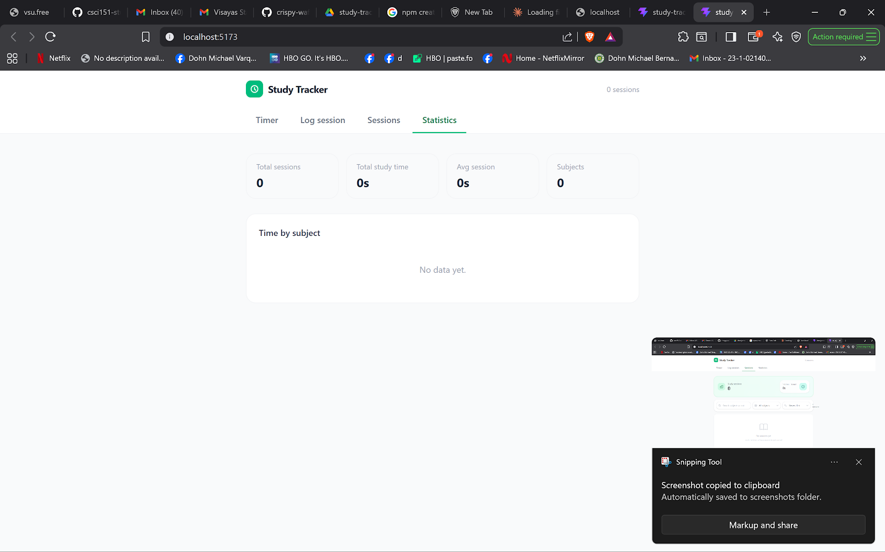
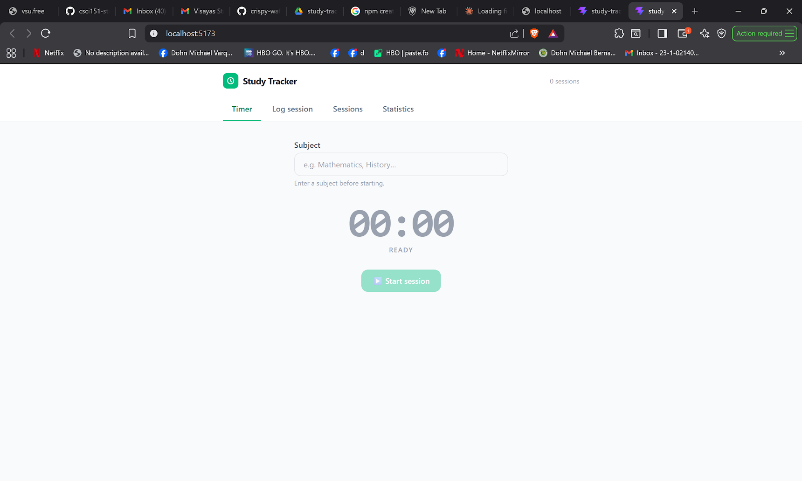
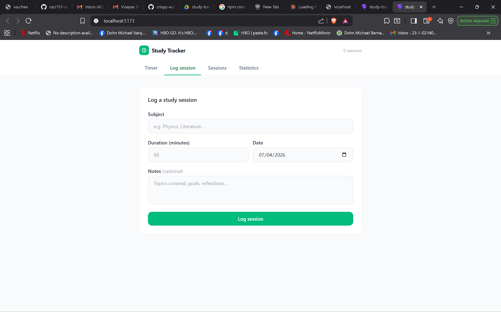
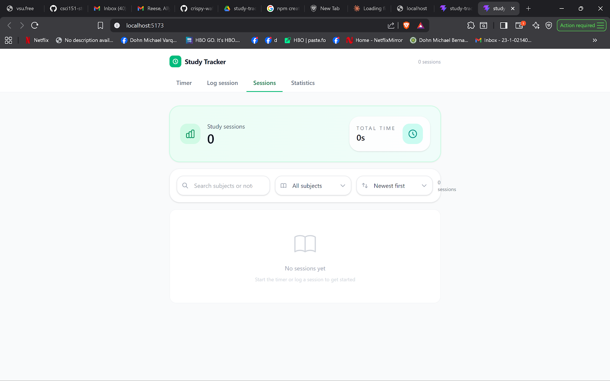

# Study Tracker

A study session tracking application that helps students monitor their study time, organize sessions by subject, and track their learning progress.

---

## Team Members

| Full Name | Role | GitHub Username | Assigned Atomic Task |
|-----------|------|-----------------|---------------------|
| Bandibas, Norman John | Developer | @eNJay143 |  Session List Display — `SessionList` component with filtering & sorting |
| Bantaculo, Reese | Developer | @reeseBan |Edit Session — edit form flow inside `SessionList` |
| Dacutanan, Angielyn | Developer | @dizzybreakfast | Built-in Timer — `Timer` component + `useTimer` hook |
| Fiel, Jack Jonel | Developer | @BigDrems | Subject Organization & Statistics — `Statistics` component + subject breakdown |
| Piedraverde, Allyson Jhen | Developer | @its_ally | Delete Session  — delete confirmation flow + `useSessions` hookEdit Session — edit form flow inside `SessionList` |
| Varquez, Dohn Michael | Developer | @Kikypochiki | Study Session Logging — `SessionForm` component + manual log UI |

---

## Features Implemented

- [x] Log Study Session — Record sessions with subject, duration, date, and notes
- [x] Session List Display — Display all study sessions with filtering and sorting
- [x] Timer Functionality — Built-in study timer with start, pause, resume, stop
- [x] View by Subject — Filter sessions by subject in the session list
- [x] Session Statistics — Total study time per subject with visual bar chart
- [x] Edit Session — Modify session details inline
- [x] Delete Session — Remove sessions with confirmation dialog
- [x] Data Persistence — Sessions saved to localStorage

---

## Technology Stack

- **Frontend Framework:** React 18
- **Language:** TypeScript
- **Build Tool:** Vite
- **Styling:** Tailwind CSS
- **State Management:** React Hooks (`useState`, `useEffect`, `useMemo`, `useCallback`)
- **Version Control:** Git & GitHub

---

## Setup & Installation

### Prerequisites
- Node.js (v18 or higher)
- npm
- Git

### Installation Steps

1. **Clone the repository**
   ```bash
   git clone https://github.com/csci151-studypal-org/study-tracker.git
   cd study-tracker
   ```

2. **Install dependencies**
   ```bash
   npm install
   ```

3. **Run the development server**
   ```bash
   npm run dev
   ```

4. **Open your browser**

   Navigate to `http://localhost:5173`

---

## Project Structure

```
study-tracker/
├── public/
├── src/
│   ├── components/
│   │   ├── Timer/
│   │   │   ├── Timer.tsx          ← Main timer component
│   │   │   ├── TimerDisplay.tsx   ← Clock face + status label
│   │   │   ├── TimerControls.tsx  ← Start/Pause/Resume/Stop buttons
│   │   │   ├── SessionSummary.tsx ← Summary card after session saved
│   │   │   └── index.ts
│   │   ├── SessionForm/
│   │   │   ├── SessionForm.tsx    ← Manual log + edit form
│   │   │   └── index.ts
│   │   ├── SessionList/
│   │   │   ├── SessionList.tsx    ← List with filter/sort
│   │   │   ├── SessionItem.tsx    ← Single session row
│   │   │   ├── DeleteConfirm.tsx  ← Delete confirmation dialog
│   │   │   └── index.ts
│   │   └── Statistics/
│   │       ├── Statistics.tsx     ← Metric cards + subject bar chart
│   │       └── index.ts
│   ├── hooks/
│   │   ├── useTimer.ts            ← Timer logic (start/pause/resume/stop/reset)
│   │   └── useSessions.ts         ← Session CRUD + localStorage persistence
│   ├── types/
│   │   └── index.ts               ← Shared TypeScript interfaces
│   ├── utils/
│   │   └── index.ts               ← Formatting helpers, color utils, storage
│   ├── App.tsx                    ← Root component + tab navigation
│   ├── main.tsx                   ← React entry point
│   └── index.css                  ← Tailwind directives
├── index.html
├── package.json
├── tailwind.config.js
├── vite.config.ts
└── tsconfig.json
```

---
## Screenshots




## Git Workflow & Branching Strategy

### Branches Used

- **`main`** — Production-ready code, protected branch
- **`develop`** — Integration branch for all features
- **`feature/log-session`** — SessionForm component for manual session logging
- **`feature/session-list`** — SessionList component with filtering and sorting
- **`feature/study-timer`** — Built-in timer with useTimer hook
- **`feature/session-stats`** — Statistics component with subject breakdown
- **`feature/edit-session`** — Edit session flow inside SessionList
- **`feature/delete-session`** — Delete confirmation + useSessions hook

### Commit Convention

We followed the **Conventional Commits** specification:

- `feat:` — New features
- `fix:` — Bug fixes
- `docs:` — Documentation updates
- `style:` — Code formatting, UI styling
- `refactor:` — Code refactoring

### Pull Request Workflow

1. Create feature branch from `develop`
2. Implement feature with atomic commits
3. Push branch to GitHub
4. Create Pull Request to `develop` using the PR template
5. Team lead and at least one teammate reviews and provides feedback
6. Address review comments
7. Merge after approval
8. Delete feature branch

---

## Individual Contributions

| Name | Feature Branch | Key Files |
|------|---------------|-----------|
| Varquez, Dohn Michael| `feature/log-session` | `SessionForm/SessionForm.tsx` |
| Bandibas, Norman John | `feature/session-list` | `SessionList/SessionList.tsx`, `SessionItem.tsx` |
| Dacutanan, Angielyn | `feature/study-timer` | `Timer/Timer.tsx`, `hooks/useTimer.ts` |
| Fiel, Jack Jonel | `feature/session-stats` | `Statistics/Statistics.tsx` |
| Bantaculo, Reese | `feature/edit-session` | `SessionList/SessionList.tsx` (edit flow), `SessionForm` (edit mode) |
|  Piedraverde, Allyson Jhen | `feature/delete-session` | `SessionList/DeleteConfirm.tsx`, `hooks/useSessions.ts`, `utils/index.ts` |

---

## Challenges & Learnings

**Challenges:**
- Coordinating shared state (`useSessions`) across multiple feature branches without merge conflicts
- Deciding which types/utils go in shared files vs. component-specific files
- Resolving conflicts in `App.tsx` when multiple branches modified the same navigation section

**Key Learnings:**
- Breaking work into truly atomic commits makes code review and conflict resolution much easier
- A shared `types/index.ts` file prevents type duplication across features
- Communicating early about shared files (like `App.tsx`) prevents large merge conflicts

---

## Repository Links

- **Organization:** https://github.com/csci151-studypal-org
- **Repository:** https://github.com/csci151-studypal-org/study-tracker

---

## Contributors

**Group 3 — CSci 151 Event Driven Programming**

Bandibas, Norman John — @eNJay143
Bantaculo, Reese — @reeseBan
Dacutanan, Angielyn — @dizzybreakfast
Fiel, Jack Jonel — @BigDrems
Piedraverde, Allyson Jhen — @its_ally
Varquez, Dohn Michael — @Kikypochiki

**Course Professors:**
- Mr. Jomari Joseph A. Barrera
- Mr. Kyle Anthony F. Nierras

**Institution:** Visayas State University — Department of Computer Science and Technology

---

**Last Updated:** April 2026
